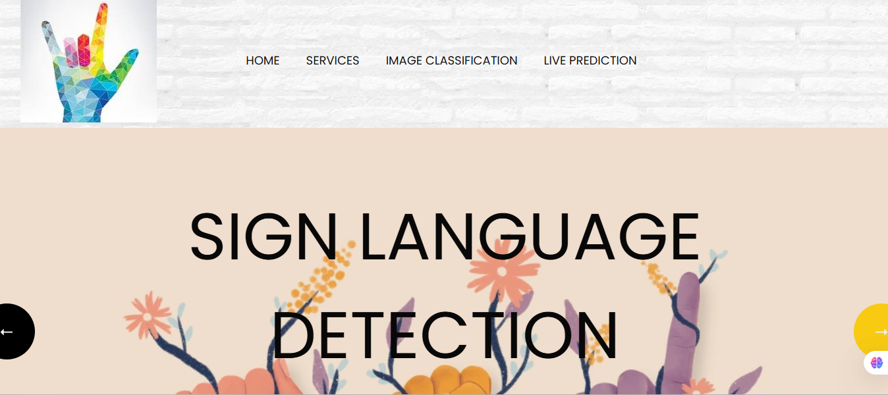

# 🧠 Sign Language Recognition Using CNN  

This project is an AI-powered **Sign Language Recognition System** built using **Convolutional Neural Networks (CNN)** and **Flask Web Framework**.  
It recognizes American Sign Language (A–Z) hand gestures from images or live webcam input and converts them into corresponding alphabets — even speaking the output aloud using **Google Text-to-Speech (gTTS)**.


---

## 📸 Features  

- ✅ **Upload-based Prediction** – Upload an image to predict the hand gesture.  
- ✅ **Live Recognition** – Detect signs in real-time using your webcam.  
- ✅ **Speech Output** – Converts the predicted alphabet into speech.  
- ✅ **Simple Web Interface** – Flask-based interactive UI.  
- ✅ **Error Handling** – Validates image formats and missing model files.  

---

## 🗂️ Project Structure  

```
CODE/
│
├── app.py # Main Flask application
├── Model/
│ ├── FinalModel.h5 # Trained CNN model for static predictions
│ ├── keras_model.h5 # Model for live recognition (cvzone)
│ └── labels.txt # Label mapping file
├── images/ # Stores uploaded images
├── templates/ # HTML templates for Flask views
│ ├── index.html
│ ├── upload.html
│ ├── about.html
│ ├── services.html
│ └── contact.html
├── static/ # Optional CSS, JS, or image files
└── example.mp3 # Auto-generated audio file for predictions
```

---

## ⚙️ Installation & Setup  

### 1️⃣ Clone the repository
```bash
git clone https://github.com/yourusername/Sign_Language_Recognition_Using_CNN.git
cd Sign_Language_Recognition_Using_CNN/CODE
```

### 2️⃣ Create and activate a virtual environment
```bash
python -m venv venv
venv\Scripts\activate      # On Windows
# or
source venv/bin/activate   # On Mac/Linux
```
### 3️⃣ Install dependencies
```bash
pip install -r requirements.txt
```
If you don’t have a requirements.txt yet, install manually:
```bash
pip install flask tensorflow keras opencv-python cvzone gTTS numpy
```
## 🧩 Model Information  

This project uses two Convolutional Neural Network (CNN) models to recognize American Sign Language (A–Z) gestures from both uploaded images and real-time webcam input.

| Model File | Purpose |
|-------------|----------|
| **FinalModel.h5** | Classifies uploaded sign language images through the Flask interface |
| **keras_model.h5** | Used for real-time webcam prediction using the CVZone classifier |
| **labels.txt** | Contains the class label mappings for the live recognition model |

Both models are trained on American Sign Language (ASL) datasets covering 26 alphabets (A–Z), ensuring robust accuracy for both static and dynamic gesture recognition.

## 🚀 How to Run  

### ▶️ Start the Flask App  

From inside the `CODE` directory, run the following command in your terminal or command prompt:

```bash
python app.py
```
You should see an output similar to this:
```bash
🚀 Flask app running...
 * Running on http://127.0.0.1:5000/
```
###🌐 Open in Browser

Once the Flask server starts, open your web browser and navigate to:
```bash
http://127.0.0.1:5000/
```
You’ll now be able to interact with the Sign Language Recognition Web App — upload images or switch to live detection mode to test your trained models in real-time.

## 💡 Usage  

### 🔹 Upload Mode  

1. Go to the **Upload** section in the web app.  
2. Choose a valid image file (`.jpg`, `.png`, `.jpeg`, `.jfif`, `.tif`).  
3. Click **Predict** to classify the uploaded image.  
4. The CNN model predicts the corresponding sign (A–Z).  
5. The system automatically plays the predicted letter aloud using **gTTS (Google Text-to-Speech)**.  

---

### 🔹 Live Detection Mode  

1. Navigate to the live detection route:  
```bash
http://127.0.0.1:5000/live
```
2. Allow webcam access when prompted.  
3. The app will start detecting your hand gestures in real time.  
4. Bounding boxes and predicted signs will appear live on the video feed.  
5. Press **ESC** to exit the live recognition window.

## 🗣️ Output Example  

Below are sample outputs demonstrating how the system predicts and speaks sign language alphabets:

| Input Image | Predicted Sign | Audio Output |
|--------------|----------------|---------------|
| ✋ | **A** | “A” spoken aloud |
| 🤚 | **M** | “M” spoken aloud |

---

## ⚠️ Common Issues & Fixes  

| Issue | Cause | Fix |
|-------|--------|-----|
| `PermissionError: [Errno 13] Permission denied: 'images/'` | Missing filename or invalid save path | ✅ Fixed by using **absolute paths** in `app.py` |
| `Model file not found!` | `FinalModel.h5` missing in `Model/` directory | Place `FinalModel.h5` inside the `Model/` folder |
| Webcam not opening | Camera already in use by another application | Close other apps using webcam and restart Flask |

## 🧠 Tech Stack  

| Category | Tools / Technologies |
|-----------|----------------------|
| **Language** | Python |
| **Framework** | Flask |
| **Deep Learning** | TensorFlow / Keras |
| **Computer Vision** | OpenCV, CVZone |
| **Speech** | gTTS (Google Text-to-Speech) |
| **Frontend** | HTML, CSS, Bootstrap |

---

## 📊 Future Enhancements  

- 🔹 Add number and word recognition (0–9, “Hello”, “Thanks”, etc.)  
- 🔹 Implement sentence prediction using sequential models (LSTM).  
- 🔹 Deploy the application on cloud platforms such as **Streamlit**, **AWS**, or **Render**.  
- 🔹 Create an Android mobile version using **Flutter** or **React Native**.  

---

## 👩‍💻 Author  

**Ashmitha Reddy Thota**  
🎓 *M.S. in Computer Science — Data Science Concentration*  
📍 *University of North Carolina at Charlotte (UNCC)*  
💼 Passionate about Deep Learning, AI, and Assistive Technologies  


